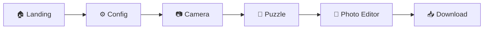

# Rebuild Scrapbook Puzzle Cam dengan React.js

Migrasi aplikasi "Scrapbook Puzzle Cam" dari vanilla HTML/JS ke React.js. **Tanpa ML** — puzzle menggunakan drag & drop, foto diambil via tombol. Ditambahkan fitur **photo editor (photobooth)** setelah puzzle selesai, dan **download foto**.

## Alur Aplikasi (User Flow)



1. **Landing Page** — Hero section, tombol "Start Creating"
2. **Config Page** — Pilih grid puzzle (3×3 atau 4×4)
3. **Camera Page** — Ambil foto dari webcam via tombol klik (1 foto)
4. **Puzzle Page** — Foto dipotong jadi puzzle, user susun ulang via drag & drop
5. **Photo Editor (Photobooth)** — Setelah puzzle selesai, edit foto: tambah frame, stiker, teks, filter
6. **Download** — Download hasil akhir sebagai gambar

---

## User Review Required

> [!IMPORTANT]
> Proyek akan di-rebuild total menggunakan **Vite + React.js**. File lama (`index.html`, `app.js`, `style.css`) akan di-replace oleh struktur project baru.

> [!IMPORTANT]
> **Tanpa Machine Learning** — Puzzle digerakkan via mouse drag / touch drag. Foto diambil via tombol capture.

---

## Open Questions

> [!IMPORTANT]
> 1. **File lama boleh di-overwrite?** Vite + React akan membuat struktur folder baru di lokasi yang sama.
> 2. **Tema warna**: Setuju dengan **warm vintage scrapbook** (krem/coklat/emas)?
> 3. **Jumlah foto**: Satu foto per sesi (dipotong jadi puzzle), atau bisa capture beberapa foto?

---

## Proposed Changes

### Tech Stack

| Tool | Tujuan |
|------|--------|
| **Vite** | Build tool & dev server |
| **React 18+** | UI framework |
| **Vanilla CSS** | Styling (tanpa Tailwind) |
| **Google Fonts** | Playfair Display + Inter |
| **Canvas API** | Potong foto, render puzzle, export hasil edit |

---

### Struktur Folder

```
d:\Dongo\rms\
├── public/
│   └── favicon.ico
├── src/
│   ├── assets/
│   │   ├── stickers/           # SVG stiker (hearts, stars, flowers, dll)
│   │   └── frames/             # Frame templates (polaroid, vintage, dll)
│   ├── components/
│   │   ├── Header.jsx
│   │   ├── LandingPage.jsx
│   │   ├── ConfigPage.jsx
│   │   ├── CameraPage.jsx
│   │   ├── PuzzlePage.jsx      # Puzzle drag & drop
│   │   ├── PuzzlePiece.jsx     # Individual puzzle piece
│   │   ├── EditorPage.jsx      # Photo editor / photobooth
│   │   ├── EditorToolbar.jsx   # Toolbar editor (frame, stiker, teks, filter)
│   │   ├── StickerLayer.jsx    # Layer stiker yang bisa di-drag
│   │   ├── TextOverlay.jsx     # Teks overlay yang bisa diedit
│   │   └── DownloadButton.jsx  # Tombol download
│   ├── styles/
│   │   ├── index.css           # Global styles & design tokens
│   │   ├── Header.css
│   │   ├── LandingPage.css
│   │   ├── ConfigPage.css
│   │   ├── CameraPage.css
│   │   ├── PuzzlePage.css
│   │   ├── EditorPage.css
│   │   └── PhotoCard.css
│   ├── utils/
│   │   ├── puzzleUtils.js      # Logic potong & shuffle puzzle
│   │   └── canvasUtils.js      # Export canvas ke image
│   ├── App.jsx
│   └── main.jsx
├── index.html
├── package.json
└── vite.config.js
```

---

### Component Details

---

#### [NEW] `src/App.jsx` — Root Component

- State management untuk navigasi halaman: `landing` → `config` → `camera` → `puzzle` → `editor` → (download)
- State global: `gridSize`, `capturedImage`, `puzzleCompleted`, `editedImage`

---

#### [NEW] `src/components/Header.jsx`

- Logo "Scrapbook Puzzle"
- Progress indicator (step 1/5, 2/5, dst.)
- Glassmorphism navbar

---

#### [NEW] `src/components/LandingPage.jsx`

- Hero typography besar "Scrapbook Puzzle!"
- Decorative elements (tape, pin — CSS only)
- Animated "START CREATING" button
- Deskripsi singkat flow aplikasi

---

#### [NEW] `src/components/ConfigPage.jsx`

- Pilihan grid: **3×3** (9 pieces) atau **4×4** (16 pieces)
- Card selection dengan hover & active state
- Preview visual grid pattern

---

#### [NEW] `src/components/CameraPage.jsx`

- Webcam stream (`getUserMedia`) dengan mirror effect
- **Tombol Capture** besar di tengah bawah
- Flash animation saat capture
- Preview foto yang sudah diambil
- Tombol retake & tombol "Lanjut ke Puzzle"

---

#### [NEW] `src/components/PuzzlePage.jsx` — Inti Puzzle

**Cara kerja puzzle:**
1. Foto yang di-capture dipotong menjadi grid (3×3 = 9 potong, atau 4×4 = 16 potong) menggunakan **Canvas API**
2. Potongan di-**shuffle** secara random
3. User **drag & drop** potongan ke posisi yang benar
4. Setiap piece yang benar di posisinya → **lock & highlight hijau**
5. Semua piece benar → **animasi "Puzzle Complete!" 🎉** → lanjut ke editor

**Detail teknis:**
```
┌───────────────────────────────────┐
│  Foto Original (dari Camera)      │
│  ┌───┬───┬───┐                    │
│  │ 1 │ 2 │ 3 │  Canvas.drawImage  │
│  ├───┼───┼───┤  (crop per cell)   │
│  │ 4 │ 5 │ 6 │  → Array of        │
│  ├───┼───┼───┤    data URLs       │
│  │ 7 │ 8 │ 9 │                    │
│  └───┘───┘───┘                    │
│         ↓ shuffle                 │
│  ┌───┬───┬───┐                    │
│  │ 5 │ 3 │ 8 │  User drag & drop  │
│  ├───┼───┼───┤  each piece to     │
│  │ 1 │ 9 │ 4 │  correct position  │
│  ├───┼───┼───┤                    │
│  │ 7 │ 2 │ 6 │                    │
│  └───┘───┘───┘                    │
└───────────────────────────────────┘
```

- Drag & drop menggunakan native HTML5 Drag & Drop API + touch events untuk mobile
- Snap-to-grid saat piece di-drop dekat posisi benar
- Visual feedback: piece yang benar berkilau, yang salah bisa digeser lagi

---

#### [NEW] `src/components/PuzzlePiece.jsx`

- Individual puzzle piece component
- Draggable via mouse & touch
- State: `isCorrect`, `currentPosition`, `originalPosition`
- Visual: slight shadow, rounded corners, hover lift effect

---

#### [NEW] `src/components/EditorPage.jsx` — Photo Editor (Photobooth)

Setelah puzzle selesai, masuk ke mode **photobooth editor**. Foto ditampilkan full dan user bisa mengedit:

**Fitur Editor:**

| Fitur | Detail |
|-------|--------|
| **🖼️ Frames** | Pilih frame: Polaroid, Vintage, Floral, Minimal, Scrapbook tape |
| **🌟 Stickers** | Drag & drop stiker ke foto: ❤️ 🌸 ⭐ 🎀 ✨ 🦋 (SVG) |
| **✏️ Text** | Tambah teks custom: pilih font, warna, ukuran. Bisa drag posisi |
| **🎨 Filters** | Filter CSS: Original, Sepia, B&W, Vintage Warm, Cool Tone, Dreamy |
| **📐 Layout** | Layout photobooth: single, strip (2 foto vertikal), grid 2×2 |

**Cara kerja editor:**
- Foto ditampilkan di dalam container
- Frame, stiker, teks di-render sebagai **layer di atas foto** (CSS positioned)
- Saat download, semua layer di-**flatten ke satu Canvas** → export sebagai PNG/JPG

---

#### [NEW] `src/components/EditorToolbar.jsx`

- Tab toolbar di bawah foto: Frames | Stickers | Text | Filters
- Scrollable horizontal list untuk opsi di setiap tab
- Active state indicator

---

#### [NEW] `src/components/StickerLayer.jsx`

- Stiker yang sudah ditambahkan ke foto
- Draggable (reposisi)
- Resizable (pinch/drag corner)
- Tombol delete per stiker

---

#### [NEW] `src/components/TextOverlay.jsx`

- Teks overlay yang bisa diedit inline
- Draggable posisi
- Panel: font, ukuran, warna, bold/italic

---

#### [NEW] `src/components/DownloadButton.jsx`

- **"Download Foto"** — Export hasil edit sebagai PNG
- Menggunakan Canvas API:
  1. Render foto ke canvas
  2. Apply filter
  3. Draw frame overlay
  4. Draw stickers pada posisi yang benar
  5. Draw text overlays
  6. `canvas.toBlob()` → create download link
- Nama file otomatis: `scrapbook-puzzle-[timestamp].png`

---

### Desain Visual

| Aspek | Detail |
|-------|--------|
| **Background** | Tekstur kertas krem `#FDFBF7` |
| **Primary** | Charcoal `#2D2D2D` |
| **Accent 1** | Golden brown `#C4956A` |
| **Accent 2** | Soft pink `#E8B4B8` |
| **Success** | Sage green `#7CB68E` |
| **Font Heading** | Playfair Display (serif, vintage) |
| **Font Body** | Inter (clean, modern) |
| **Effects** | Glassmorphism header, washi tape CSS, paper texture, warm shadows |
| **Animations** | Page transitions (fade + slide), puzzle piece snap, capture flash, confetti on puzzle complete |

---

### Assets yang Akan Dibuat

#### Stickers (SVG, dibuat via code)
- ❤️ Heart
- ⭐ Star
- 🌸 Flower
- 🎀 Ribbon
- ✨ Sparkle
- 🦋 Butterfly
- 💬 Speech bubble
- 📌 Pin

#### Frames (CSS-rendered)
1. **Polaroid** — White border bawah tebal, font handwriting
2. **Vintage** — Double border, aged corner effect
3. **Floral** — Border dengan pattern bunga
4. **Minimal** — Thin border, clean
5. **Scrapbook** — Washi tape di corner, slightly rotated

---

## Verification Plan

### Manual Verification (Dilakukan oleh User)

1. **Setup:**
   ```bash
   npm install
   npm run dev
   ```

2. **Test Flow Lengkap:**
   - [ ] Landing page tampil dengan desain premium
   - [ ] Klik "START CREATING" → Config page
   - [ ] Pilih grid 3×3 atau 4×4 → Camera page
   - [ ] Kamera menyala, tombol capture berfungsi
   - [ ] Foto di-capture → masuk Puzzle page
   - [ ] Puzzle pieces bisa di-drag & drop
   - [ ] Puzzle selesai → animasi congrats → masuk Editor
   - [ ] Bisa tambah frame, stiker, teks, filter
   - [ ] Download foto berfungsi (file PNG ter-download)

3. **Test Responsive:**
   - [ ] Mobile view (Chrome DevTools)
   - [ ] Touch drag puzzle berfungsi
   - [ ] Touch drag stiker berfungsi

4. **Verifikasi Tanpa ML:**
   - [ ] Tidak ada library MediaPipe/TensorFlow/handtrack di `package.json`
   - [ ] Semua interaksi via mouse/touch
