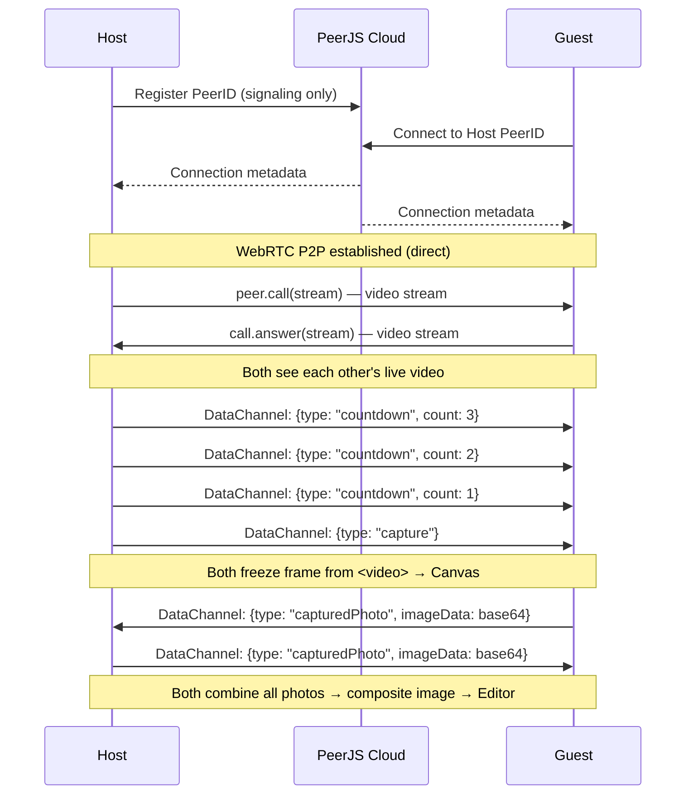

# Room Mode: Live Video Preview + Synchronized Capture

Implementasi Room Mode dengan pendekatan **Live Video Preview** — semua peserta bisa melihat satu sama lain secara real-time via WebRTC, lalu foto diambil bersamaan menggunakan countdown yang tersinkronisasi. Hasil foto dari semua peserta digabung menjadi satu gambar composite.

## Persyaratan Utama

1. **Live Video Preview** — Setiap peserta bisa melihat video feed teman-teman dalam grid real-time
2. **Synchronized Capture** — Countdown berjalan di semua perangkat secara bersamaan → freeze frame → combine ke Canvas
3. **Deploy di Vercel** — Static SPA, tanpa backend server
4. **Zero Photo Storage** — Tidak ada foto yang tersimpan di server manapun, semua P2P & client-side only
5. **Privasi User** — Tidak ada rekam jejak (no logging, no analytics tracking foto)

## Arsitektur & Cara Kerja



### Alur Data:
1. **Signaling**: PeerJS Cloud (free) — hanya menukar metadata koneksi, **bukan** foto/video
2. **Video Stream**: WebRTC P2P langsung antar perangkat — **tidak melewati server**
3. **Foto Capture**: Canvas API di browser masing-masing — **tidak dikirim ke server**
4. **Composite**: Digabung di Canvas client-side → download langsung ke device user

### Privasi:
- ✅ PeerJS Cloud hanya menyimpan temporary peer ID untuk signaling (auto-expired)
- ✅ Video stream P2P langsung, tidak melewati server
- ✅ Foto hanya ada di memori browser, tidak di-upload ke manapun  
- ✅ Saat user keluar/refresh, semua data hilang otomatis (JavaScript garbage collection)
- ✅ Tidak ada cookies, analytics, atau logging terkait foto

## Batasan Vercel

| Aspek | Penjelasan |
|-------|-----------|
| **Hosting** | Static SPA only (`dist/` folder) — tidak ada WebSocket server |
| **Signaling** | Pakai PeerJS Cloud gratis (0.peerjs.com) — sudah termasuk di library |
| **TURN Server** | Tidak self-host. PeerJS default pakai Google STUN server gratis. Jika peer di belakang NAT ketat, koneksi mungkin gagal (trade-off acceptable) |
| **Rewrites** | Perlu `vercel.json` untuk SPA routing |

> [!IMPORTANT]
> **STUN vs TURN**: Koneksi P2P via STUN server gratis bisa gagal jika kedua user di belakang NAT simetris yang ketat (jarang terjadi di Indonesia untuk koneksi WiFi/mobile biasa). Untuk coverage 100%, diperlukan TURN server (berbayar). Apakah trade-off ini acceptable?

## Proposed Changes

### Vercel Deployment Config

#### [NEW] [vercel.json](file:///d:/Dongo/rms/vercel.json)
- SPA rewrite rules agar semua path ke `index.html`
- Tambah security headers (no-cache untuk HTML, privacy headers)

```json
{
  "rewrites": [{ "source": "/(.*)", "destination": "/index.html" }],
  "headers": [
    {
      "source": "/(.*)",
      "headers": [
        { "key": "X-Content-Type-Options", "value": "nosniff" },
        { "key": "X-Frame-Options", "value": "DENY" },
        { "key": "Referrer-Policy", "value": "no-referrer" }
      ]
    }
  ]
}
```

---

### PeerService (Core WebRTC Logic)

#### [MODIFY] [peerService.js](file:///d:/Dongo/rms/src/utils/peerService.js)
**Perubahan besar** — Tambahkan kemampuan media stream (video call) di samping data channel yang sudah ada:

- **Tambah `startVideoCall(localStream)`** — Inisiasi `peer.call()` ke semua koneksi yang ada, dan dengarkan incoming call
- **Tambah event `streamReceived`** — Emit saat remote video stream diterima (untuk ditampilkan di `<video>`)
- **Tambah event `streamRemoved`** — Emit saat peer disconnect (untuk remove video element)
- **Tambah `broadcastCountdown(count)`** — Host kirim countdown ke semua peer via data channel
- **Tambah `broadcastCaptureSignal()`** — Host kirim sinyal "capture now" ke semua peer
- **Tambah event `countdownReceived`** & `captureSignal`** — Guest listen events ini
- **Tambah `sendCapturedPhoto(imageData)`** — Kirim foto hasil capture ke semua peer
- **Tambah `stopVideo()`** — Stop semua media tracks saat keluar camera page
- **Privacy**: Pastikan `destroy()` juga menghapus semua media tracks & references

---

### Room Camera Page (Video Grid + Synchronized Capture)

#### [NEW] [RoomCameraPage.jsx](file:///d:/Dongo/rms/src/components/RoomCameraPage.jsx)
Halaman kamera khusus Room mode (terpisah dari CameraPage solo). Fitur:

1. **Video Grid Layout** — Tampilkan video lokal + video remote peers dalam grid:
   - 2 orang → side by side
   - 3 orang → 2+1 layout
   - 4 orang → 2×2 grid

2. **Synchronized Countdown** — Host tekan tombol capture → countdown 3-2-1 muncul di semua device bersamaan

3. **Freeze Frame** — Saat countdown habis, semua video di-freeze (pause) dan di-capture ke canvas

4. **Photo Exchange** — Setelah capture:
   - Capture video lokal (full resolution dari camera stream)
   - Capture video remote (dari `<video>` element — resolution tergantung stream)
   - Kirim foto lokal ke peers via data channel
   - Terima foto high-res dari peers (replace yang dari video element)

5. **Composite Preview** — Tampilkan preview gabungan semua foto sebelum lanjut ke editor

6. **Multi-round capture** — Bisa ambil hingga 4 ronde foto (setiap ronde = 1 composite dari semua orang)

#### [NEW] [RoomCameraPage.css](file:///d:/Dongo/rms/src/styles/RoomCameraPage.css)
- Grid layout untuk video feeds (responsive 2/3/4 orang)
- Countdown overlay animation
- Status indicators (waiting, connected, capturing)
- Freeze frame visual effect

---

### App Routing

#### [MODIFY] [App.jsx](file:///d:/Dongo/rms/src/App.jsx)
- Import `RoomCameraPage` 
- Saat mode `room`, routing ke `RoomCameraPage` instead of `CameraPage`
- Pass `peerRoom` ref ke `RoomCameraPage`
- Terima composite photos dari `RoomCameraPage` → langsung ke Editor (skip Puzzle)

---

### Landing Page

#### [MODIFY] [LandingPage.jsx](file:///d:/Dongo/rms/src/components/LandingPage.jsx)
- Re-enable Room Mode card (hapus `disabled`, ganti label kembali ke "NEW")

---

### Canvas Utils (Privacy Cleanup)

#### [MODIFY] [canvasUtils.js](file:///d:/Dongo/rms/src/utils/canvasUtils.js)
- `combinePhotosToComposite` sudah ada, pastikan tetap berfungsi
- Tambah fungsi `captureVideoFrame(videoElement)` — utility untuk freeze frame dari `<video>` element ke data URL

---

## Open Questions

> [!IMPORTANT]
> **Maksimal peserta per room**: Berapa orang maksimum yang diinginkan? WebRTC mesh topology (semua terhubung ke semua) mulai berat di 4+ orang. Saran saya **maks 4 orang** agar performa tetap baik di HP biasa. Setuju?

> [!IMPORTANT]  
> **Audio**: Apakah perlu audio (suara) saat video preview? Atau video-only (tanpa suara) supaya lebih ringan dan sederhana?

> [!IMPORTANT]
> **STUN-only trade-off**: Tanpa TURN server, ~10-15% koneksi P2P mungkin gagal (tergantung jaringan). Ini acceptable atau perlu cari TURN server gratis/murah?

## Verification Plan

### Automated Tests
- `npm run build` — pastikan build sukses
- Browser test: buka 2 tab → create room di tab 1 → join di tab 2 → verifikasi video muncul di kedua tab
- Capture test: trigger countdown → verifikasi foto composite terbentuk

### Manual Verification
- Test di 2 device berbeda (HP + laptop) via Vercel deploy
- Verifikasi privasi: check Network tab → tidak ada foto yang dikirim ke server manapun
- Verifikasi cleanup: refresh page → pastikan tidak ada data tersisa
